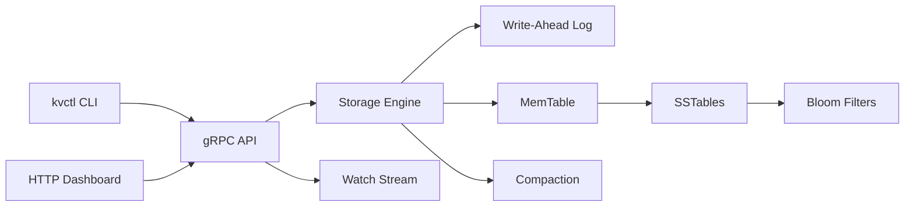

# KV Store

A Rust key-value store prototype inspired by LevelDB, RocksDB, etcd, and the
storage/consensus ideas behind distributed databases.

The project currently includes a durable single-node LSM-style storage engine,
a gRPC API, a CLI client, and a browser dashboard for inspecting and operating
the store locally. Raft modules are scaffolded and are the next major milestone.

## Highlights

- Durable writes through a checksummed write-ahead log
- In-memory sorted MemTable backed by `BTreeMap`
- Tombstone-based deletes
- Immutable SSTable files with an index block and footer
- Bloom filters for fast negative lookups
- Manual flush and full SSTable compaction
- Prefix scans with sorted results
- gRPC API for remote clients
- CLI client for local and remote operation
- Browser dashboard with live stats, LSM flow, benchmark runner, import/export,
  dark mode, and live watch events
- gRPC `Watch` stream plus dashboard Server-Sent Events

## Current Status

This is not yet a production distributed database. It is a learning-focused
systems project that already demonstrates the core storage engine and API layer.

Implemented:

- `put`, `get`, `delete`, `scan`
- WAL recovery after restart
- SSTable flush and reload
- Bloom-filter-backed SSTable lookups
- Compaction that keeps the newest version and drops obsolete tombstones
- gRPC server/client
- HTTP dashboard on top of the local server
- Watch events for writes and deletes
- Benchmark and JSON snapshot import/export from the dashboard

In progress / roadmap:

- Raft leader election
- Raft log replication
- Cluster membership
- Distributed snapshots
- Chaos testing across multiple nodes

## Architecture



## Project Layout

```text
.
├── proto/
│   └── kvstore.proto
├── src/
│   ├── main.rs
│   ├── client/
│   ├── server/
│   ├── storage/
│   │   ├── memtable.rs
│   │   ├── wal.rs
│   │   ├── sstable.rs
│   │   ├── bloom.rs
│   │   ├── compaction.rs
│   │   └── engine.rs
│   └── raft/
└── tests/
    └── storage_tests.rs
```

## Requirements

- Rust stable
- Cargo

Install Rust with rustup if needed:

```bash
curl --proto '=https' --tlsv1.2 -sSf https://sh.rustup.rs | sh
source "$HOME/.cargo/env"
```

Verify:

```bash
rustc --version
cargo --version
```

## Run Tests

```bash
cargo test
cargo clippy --all-targets -- -D warnings
```

## Local CLI Usage

The CLI can operate directly on a local data directory:

```bash
cargo run -- put hello world
cargo run -- get hello
cargo run -- delete hello
cargo run -- scan --prefix user: --limit 100
cargo run -- stats
cargo run -- flush
cargo run -- compact
```

Use a custom data directory:

```bash
cargo run -- --data-dir /tmp/kv-local put user:1 alice
cargo run -- --data-dir /tmp/kv-local get user:1
```

## Run The Server

Start the gRPC server and dashboard:

```bash
cargo run -- --data-dir /tmp/kv-server server \
  --addr 127.0.0.1:50051 \
  --dashboard-addr 127.0.0.1:8080
```

Open the dashboard:

```text
http://127.0.0.1:8080/
```

Important: port `50051` is the gRPC endpoint. Browsers should open the dashboard
port, usually `8080`.

## Remote CLI Usage

In another terminal:

```bash
cargo run -- --endpoint http://127.0.0.1:50051 put user:1 alice
cargo run -- --endpoint http://127.0.0.1:50051 get user:1
cargo run -- --endpoint http://127.0.0.1:50051 scan --prefix user: --limit 10
cargo run -- --endpoint http://127.0.0.1:50051 stats
cargo run -- --endpoint http://127.0.0.1:50051 flush
cargo run -- --endpoint http://127.0.0.1:50051 compact
```

Watch live write/delete events:

```bash
cargo run -- --endpoint http://127.0.0.1:50051 watch --prefix user:
```

Then write from another terminal or from the dashboard:

```bash
cargo run -- --endpoint http://127.0.0.1:50051 put user:2 bob
cargo run -- --endpoint http://127.0.0.1:50051 delete user:2
```

## Dashboard Features

The dashboard includes:

- storage statistics
- LSM flow view
- live signal charts
- put/delete/get controls
- prefix scan table
- row click-to-select
- JSON export for scan results
- JSON snapshot import
- browser-side benchmark runner
- dark/light theme toggle
- live watch event feed

Example JSON import payload:

```json
{
  "rows": [
    { "key": "user:1", "value": "alice" },
    { "key": "user:2", "value": "bob" }
  ]
}
```

## Storage Format Notes

The WAL format is:

```text
[length u32][op u8][key_len u32][value_len u32][key][value][crc32 u32]
```

The operation byte supports both puts and deletes. The CRC protects recovery
from partially written or corrupted records.

SSTables are immutable files containing sorted key/value records, an index, a
footer, and Bloom-filter metadata.

## Useful Demo

```bash
cargo run -- --data-dir /tmp/kv-demo server \
  --addr 127.0.0.1:50051 \
  --dashboard-addr 127.0.0.1:8080
```

Then open:

```text
http://127.0.0.1:8080/
```

Try:

1. Press `Seed Demo Data`
2. Scan prefix `user:`
3. Press `Run Bench`
4. Export rows as JSON
5. Paste JSON into Snapshot Import
6. Watch live events update in the dashboard

## Roadmap

- Implement Raft leader election
- Add Raft log replication
- Apply writes through Raft instead of direct local mutation
- Add follower redirect to leader
- Add snapshots for Raft log compaction
- Add cluster configuration and dynamic membership
- Add chaos tests for node crashes and network partitions

## Why This Project Exists

This project is built to learn real systems engineering by implementing the
pieces that power databases:

- durable disk formats
- recovery
- indexing
- compaction
- RPC APIs
- live event streams
- eventually, distributed consensus

